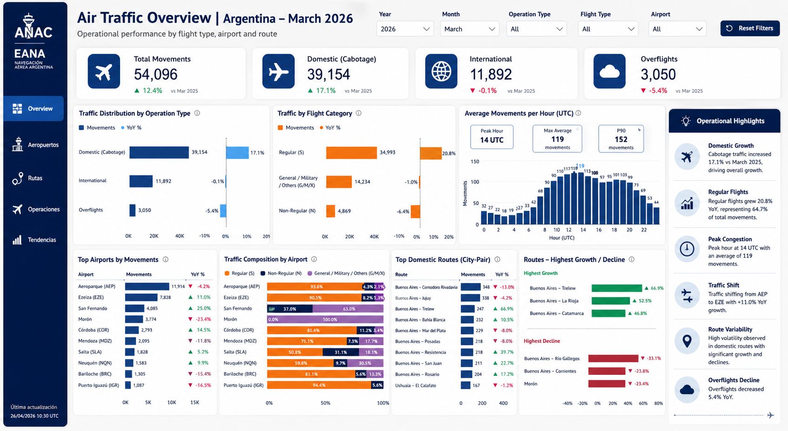

# Air Traffic Control & Resource Management Dashboard

## 📊 Visualización Ejecutiva

## 📌 Escenario de Negocio
Desarrollo orientado a la alta dirección de **EANA (Empresa Argentina de Navegación Aérea)** para la supervisión integral de la performance operativa en aeropuertos y torres de control nacionales. El sistema centraliza la gestión de tráfico aéreo y la asignación de recursos humanos, permitiendo una transición de una administración reactiva a una basada en eficiencia operativa y financiera.

## 🛠️ Stack Tecnológico
* **Visualización:** Power BI Desktop.
* **Modelado:** Esquema en estrella (Star Schema) diseñado para alta performance en filtros cruzados.
* **Ingeniería de Datos:** SQL para la extracción y transformación de registros operativos.
* **Lógica de Negocio:** DAX avanzado para cálculos de percentiles de demanda y proyecciones de ahorro.

## 💰 Impacto Económico y Gestión de Recursos
El dashboard se convirtió en la herramienta central para la optimización de costos directos de la operación terrestre:

* **Reducción del 18% en Horas Extras:** Mediante el análisis de **P90 (Percentil 90)** de movimientos por hora, se identificaron los requerimientos reales de personal por torre, permitiendo rediseñar los cronogramas de los controladores y eliminar guardias pasivas innecesarias.
* **Optimización del 15% en Viáticos y Traslados:** Se implementó un modelo de criticidad que prioriza las comisiones de mantenimiento técnico hacia aeropuertos con mayor volumen de tráfico, reduciendo desplazamientos de soporte no urgentes.
* **Gestión de Personal en Torre:** Los gerentes pueden visualizar la carga de trabajo proyectada por aeropuerto, facilitando la reasignación dinámica de recursos técnicos y administrativos según la demanda de tráfico nacional e internacional.

## 🚀 Desafíos Técnicos Resueltos

1. **Unificación de Datos Fragmentados:** Consolidación de múltiples fuentes de datos de vuelos y registros de personal en un modelo de datos único y coherente.
2. **Análisis de Rutas Críticas (City-Pair):** Modelado de jerarquías para identificar el crecimiento de rutas específicas, permitiendo a la dirección anticipar la necesidad de mayores recursos en destinos en expansión.
3. **UX para Perfiles Gerenciales:** Diseño de una interfaz de alta densidad informativa con un panel de "Operational Highlights" que resume tendencias críticas sin requerir navegación profunda.

---
*Este proyecto fue desarrollado bajo un perfil Semi-Senior (SSR), integrando ingeniería de datos con visión de negocio y optimización financiera.*
